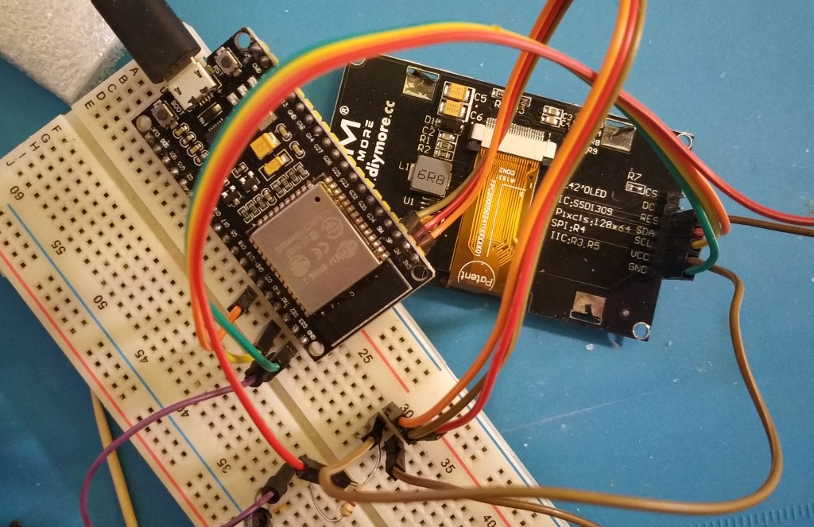

ESP32 ESP-IDF test app for OLED module
====================

Test app for [OLED module] https://www.diymore.cc/collections/led-display-module/products/2-42-inch-12864-oled-display-module-iic-i2c-spi-serial-for-arduino-c51-stm32-green-white-blue-yellow from diymore

I bought this module on aliexpress [2.42 inch 128X64 OLED LCD Display Module](https://www.aliexpress.com/item/33044134713.html). 
I can't use this module as SSD1309 with u8g2 library, but it works as SSD1306 module

## Start app

1. Clone app
2. Create a directory called `components` in your main project directory.
3. Change into the `components` directory.
4. Run `git clone https://github.com/olikraus/u8g2.git` to bring in a the latest copy of u8g2 library.
5. Change into the `u8g2` directory.
6. Create a file called `component.mk`
7. Enter the following in the `component.mk` file:
```
COMPONENT_SRCDIRS:=csrc
COMPONENT_ADD_INCLUDEDIRS:=csrc
```
8. Compile with idf.py build
9. Flash and start

## Hardware




*Code in this repository is in the Public Domain (or CC0 licensed, at your option.)
Unless required by applicable law or agreed to in writing, this
software is distributed on an "AS IS" BASIS, WITHOUT WARRANTIES OR
CONDITIONS OF ANY KIND, either express or implied.*
